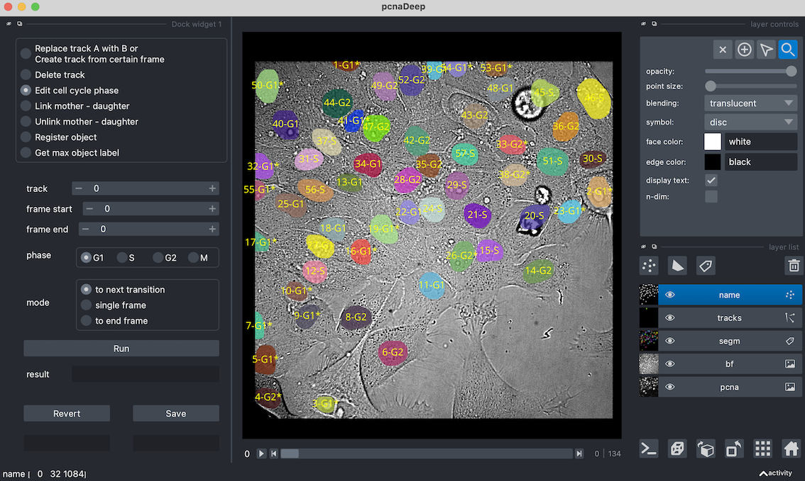

# pcnaDeep-napari
 
A customized interface for single cell track visualisation based on [pcnaDeep](https://github.com/chan-labsite/PCNAdeep) and [napari](https://github.com/napari/napari).

## :eyes: Under construction

You can get test image data from [pcnaDeep demo data](https://github.com/chan-labsite/PCNAdeep/tree/main/examples).

_TODO_: usage tutorials.

---


## Requirements
```
pcnaDeep
napari>=0.4.12
```

## Usage
- If you have the composite image:
   ```
   # image: composite image, PCNA fluorescence the first channel, bright field the last.
   # mask: PCNAdeep output binary objrct mask.
   # track: PCNAdeep output tracked object table.
   python launch.py --image data/MCF10A_demo_comp.tif --mask data/MCF10A_demo_mask.tif --track data/MCF10A_demo_tracks_refined.csv
   ```

- Otherwise, use raw `uint16` images of the above two channels with automatic pre-processing steps.
   ```
   # sat: pixel saturation for rescaling PCNA and bright field.
   # gamma: gamma factor for processing PCNA.
   python launch.py --bf data/MCF10A_demo_bf.tif --pcna data/MCF10A_demo_pcna.tif --mask data/MCF10A_demo_mask.tif --track data/MCF10A_demo_tracks_refined.csv --sat 1 --gamma 1
   ```

This is __not a napari plugin__ and you must launch the interface through the `launch.py` script. 

## Licence

pcnaDeep-napari is released under the [Apache 2.0 license](LICENSE).
